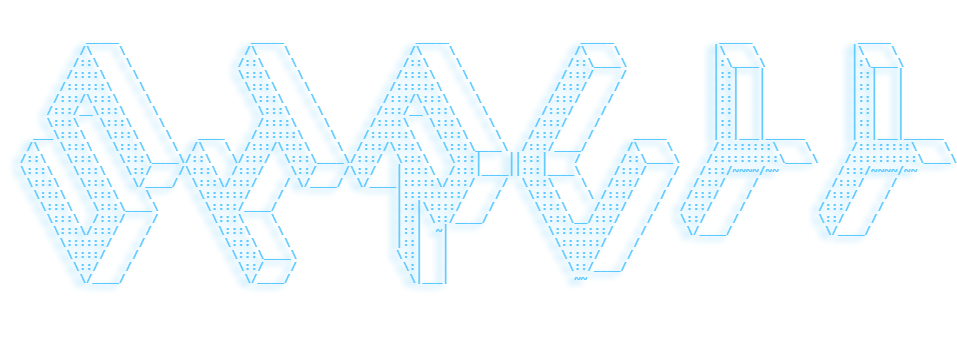

<!-- ─────────────────────────── HEADER / BANNER ─────────────────────────── -->

  

**Software Engineer · ML/AI Enthusiast · Full-stack Web & Mobile Developer**

---

### About Me

- 🛠️ &nbsp; Full-stack software engineer specializing in end-to-end development of scalable web & mobile apps
- ☁️ &nbsp; Experienced in architecture, cloud infrastructure, DevOps, and deployment pipelines
- 🖥️ &nbsp; Back-end systems in **C#** & **Node.js**, front-end with **TypeScript** & **Tailwind** across **Angular** & **Next.js**
- 📱 &nbsp; Mobile development with **Flutter**
- 🧠 &nbsp; Expanding into **machine learning** workflows to build data-driven, production-ready solutions
- 🏠 &nbsp; Self-hosting enthusiast running a **homelab**; Raspberry Pi cluster + mini server setup

### Main Stack

  

<strong>Also Worked With</strong>

 

  

<strong>Homelab & DevOps</strong>

 

  Self-hosting enthusiast running services on a <strong>Raspberry Pi</strong> homelab. 
  Experienced across the full DevOps lifecycle — CI/CD pipelines, containerization, infrastructure automation, and monitoring.

  

---

### Stats

  
  

  
  

  

---

<!-- ──────────────────── CONTRIBUTION SNAKE ──────────────────── -->

<picture>
  <source media="(prefers-color-scheme: dark)" srcset="https://raw.githubusercontent.com/Siruyy/Siruyy/output/github-snake-dark.svg" />
  <source media="(prefers-color-scheme: light)" srcset="https://raw.githubusercontent.com/Siruyy/Siruyy/output/github-snake.svg" />
  
</picture>

---

&nbsp;&nbsp;

